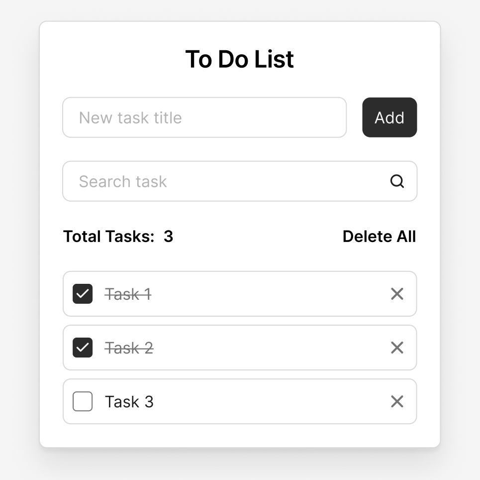

# 📝 To Do List in Vanilla JS

A simple, minimalist "To Do List" application built **without frameworks or libraries** — only **HTML**, **CSS**, and **Vanilla JS**.

The goal of the project is to show how to implement a full-fledged interactive application using only the native capabilities of the browser.

## 📸 Design

The interface is taken from a free Figma template. It looks clean and clear:



🔗 [Figma Design Link](https://www.figma.com/design/5g3oOYX6GNlezUCuk1xmaS/To-Do-List)

## ⚙️ Features

- ✅ Add a new task (via input field)  
- ✅ Real-time search through current tasks  
- ✅ Mark a task as completed  
- ✅ Delete a single task  
- ✅ Delete all tasks  
- ✅ Task counter  
- ✅ Save all data in `localStorage`  
- ✅ Support for Enter key and autofocus  

## 💡 Stack

- **HTML5**  
- **CSS3**  
- **JavaScript (ES6+)**  
  Without bundlers, libraries, frameworks, or external dependencies

## 🚀 How to run

1. Clone the repository:

```bash
git clone git@github.com:sabyrusha/todo-vanilla.git
```

2. Open index.html in the browser — everything works without a build step.
